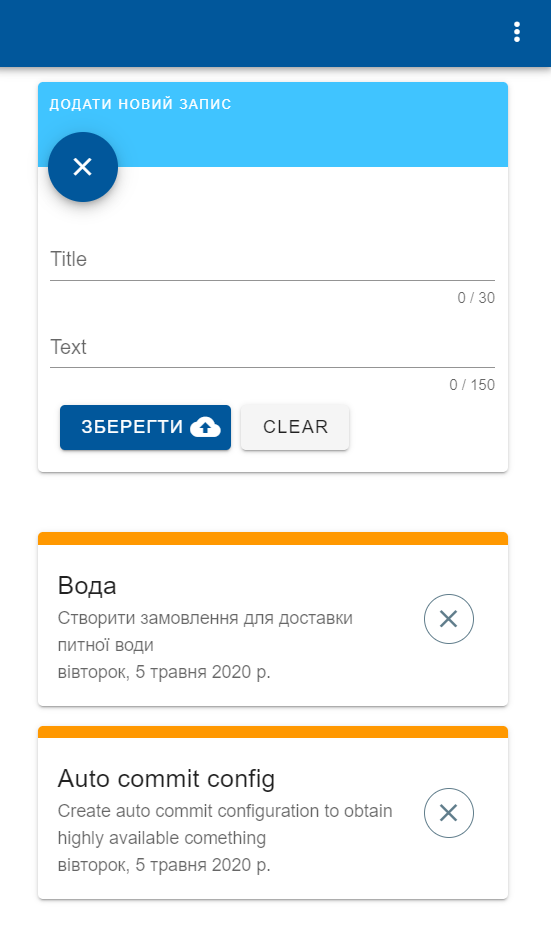

# vue-hellow

Tools
- Vue 
- Vuetify 
- Firestore
- Firebase auth (Google)
- PWA

Real world demo: https://avueua.web.app

Some screen:
<p align="center">
  
</p>


##### Project setup
```
npm install
```

##### Compiles and hot-reloads for development
```
npm run serve
```

##### Compiles and minifies for production
```
npm run build
```

##### Lints and fixes files
```
npm run lint
```
